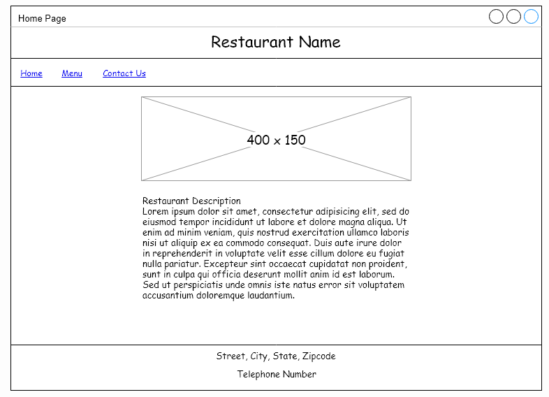
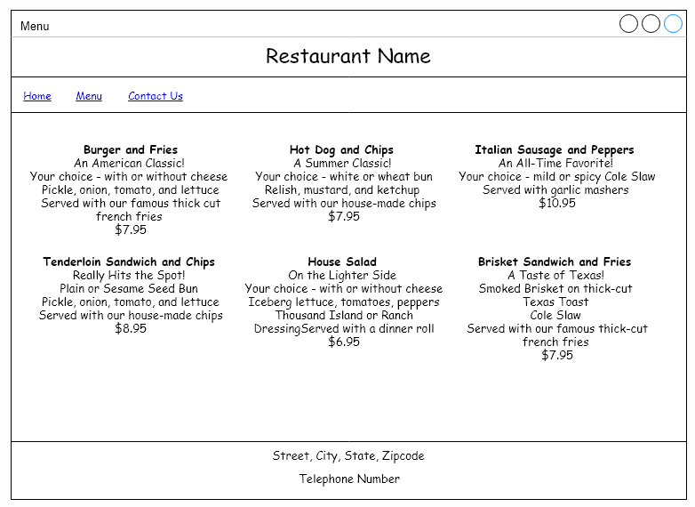
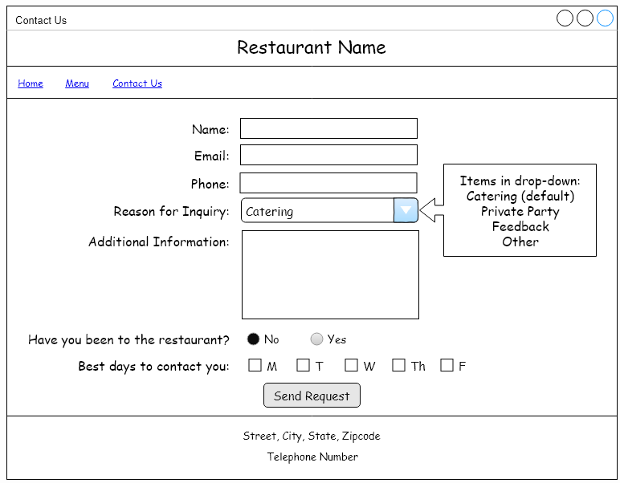

# Restaurant Site: HTML CSS and JS Technical Project
Live Demo: https://insert.livedemo.com

## Acknowledgements
* The Software Guild: https://www.thesoftwareguild.com/

## Requirements
### HTML
1. Site and pages must be laid out to match wireframes below
2. Must create name for restaurant
3. Must supply fictional address and phone number for restaurant
4. Must supply picture for restaurant home page
5. Must supply description of restaurant
#### Wireframes For HTML   

   
   
### CSS
1. Header and Footer must match across pages, store styles in external file called `restaurantStyles.css`
2. Apply all positioning CSS styles for image on home page as inline style
3. Apply styles for menu and contact form as internal style sheets
4. Style restaunt name with hosted or embedded font
5. Make sure menu item names are larger than their descriptions
6. Give menu background color other than white
7. Set background of home page content - not including header, footer, or site navigation - to color other than white
8. Set form labels for required fields to be bold
9. Style site navigation so that: 
    * visited links appear in different color than their default state
    * when hover over a link, text is bold. This should only be when hovering. Otherwise the text should be normal thickness
    * active links should not be underlined
10. Add section to menu for beverages, with table like below
11. Style beverage table to match site look and feel
#### Table Style for Beverage Menu

   

### JavaScript
1. Add Bootstrap to the site.
2. Style the site navigation to use either tabs or pills
3. Use jumbotron or page header to call out big news - Restaurant is Opening a New Location!
4. Make site responsive using Bootstrap grid system
    * Menu items should stack well, no overlap
    * Front page content should stack well
    * Change `Home` link to use an icon from supported fonts that look like a house
5. Add a Carousel that rotates with three pieces of information:
    * Opening a new location
    * Rolling out season menu, with special options for the season
    * Drink of the month is SG Special Brew
6. Use Bootstrap form items for `Contact Us` form
    * validate in JavaScript that data has been provided
    * give message that information is valid without submitting anywhere
7. Users who have JavaScript disabled know that this site is best viewed with JavaScript enabled

